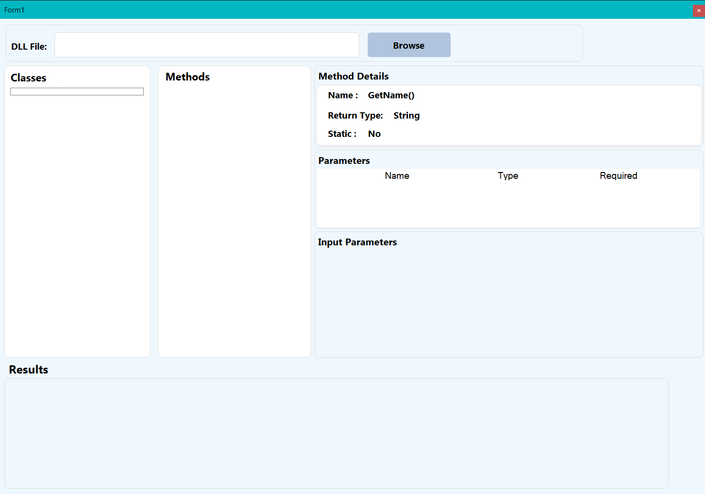

# 🔍 Simple Reflection Project

A practical **C# Windows Forms application** built to explore and apply **.NET Reflection** concepts in a real working project.

The application allows users to load an external `.dll` assembly, inspect its classes, explore methods and properties, provide method parameters dynamically, execute selected members at runtime, and display their results.

> **This project was created primarily as a practical learning exercise to turn Reflection concepts into working code. The focus was on understanding and applying the core concepts rather than expanding the application into a large-scale or production-ready system.**

---

## 🖥️ Application Preview



The dashboard provides a simple interface for loading an assembly, exploring its classes and members, providing required parameters, executing members, and viewing their results.

---

## ✨ Features

* 📦 Load external `.dll` assemblies dynamically.
* 🔎 Discover classes contained in an assembly.
* 🧩 Explore class members using Reflection.
* ⚙️ Display methods and properties.
* 📋 Inspect method parameters and their types.
* 🏷️ Display information about selected members.
* 🧠 Dynamically generate input controls based on parameter types.
* ▶️ Execute methods using `MethodInfo.Invoke()`.
* 🏗️ Create class instances dynamically using `Activator.CreateInstance()`.
* 🔧 Read and modify writable properties dynamically.
* 👀 Display property values from returned objects.
* 📊 Display `DataTable` results using a `DataGridView`.
* 🚫 Detect read-only properties and prevent assigning values to them.

---

## 🛠️ Technologies Used

| Technology               | Usage                                    |
| ------------------------ | ---------------------------------------- |
| **C#**                   | Main programming language                |
| **.NET Framework 4.7.2** | Application framework                    |
| **Windows Forms**        | Desktop user interface                   |
| **System.Reflection**    | Runtime type and member inspection       |
| **MethodInfo**           | Dynamic method invocation                |
| **PropertyInfo**         | Dynamic property access and modification |
| **ParameterInfo**        | Method parameter inspection              |
| **Activator**            | Runtime object creation                  |
| **DataTable**            | Tabular result handling                  |
| **Guna UI2**             | UI components                            |
| **FontAwesome.Sharp**    | Icons                                    |

---

## 🧠 Reflection Concepts Applied

The project focuses on applying several important Reflection concepts in practice:

* `Assembly`
* `Type`
* `MemberInfo`
* `MethodInfo`
* `PropertyInfo`
* `ParameterInfo`
* `Activator.CreateInstance()`
* `MethodInfo.Invoke()`
* `PropertyInfo.GetValue()`
* `PropertyInfo.SetValue()`
* `GetMembers()`
* `GetProperties()`
* Runtime type inspection
* Dynamic UI generation

---

## 🔄 How It Works

```text
Select DLL
    ↓
Load Assembly
    ↓
Discover Classes
    ↓
Select Class
    ↓
Discover Methods & Properties
    ↓
Select Member
    ↓
Inspect Parameters / Property
    ↓
Generate Input Controls
    ↓
Enter Values
    ↓
Execute Member
    ↓
Display Result
```

---

## 🎯 Project Purpose

The main purpose of this project was **learning by building**.

Instead of studying Reflection only through theoretical examples, I wanted to understand how its different APIs could work together inside an actual application.

The project was intentionally kept focused on the core Reflection concepts rather than being expanded into a large or production-oriented tool.

### What I wanted to practice

* Loading assemblies at runtime.
* Discovering classes and members dynamically.
* Inspecting method parameters.
* Creating objects dynamically.
* Invoking methods without directly referencing them.
* Reading and modifying properties at runtime.
* Generating UI controls according to runtime types.
* Handling and displaying different types of returned values.

> **The goal was not to build a feature-heavy application. The goal was to understand the concepts deeply by applying them in a practical project.**

---

## 📚 What I Learned

Through this project, I gained practical experience with how Reflection can be used to make an application interact with types that are not necessarily known at compile time.

In particular, I practiced the complete flow from:

```text
Assembly
   ↓
Type
   ↓
Member
   ↓
Parameters
   ↓
Invocation
   ↓
Result
```

This helped me understand the relationship between the main Reflection classes and how they can be combined to build a dynamic application.

---

## 📁 Project Structure

```text
SimpleReflectionProject/
│
├── Form1.cs
├── Form1.Designer.cs
├── Form1.resx
│
├── clsMemberItem.cs
├── clsUIManager.cs
│
├── Program.cs
├── App.config
├── ReflectionProject.csproj
├── ReflectionProject.sln
├── packages.config
├── Dashboard.png
├── .gitignore
│
└── Properties/
```

### Main Components

**`Form1.cs`**
Contains the main Reflection workflow, including assembly loading, class/member discovery, method execution, and result handling.

**`clsUIManager.cs`**
Responsible for dynamically creating parameter input controls and retrieving values from the generated controls.

**`clsMemberItem.cs`**
Represents a Reflection member and stores information used by the application when displaying and selecting members.

**`Program.cs`**
Contains the application's entry point.

---

## 🚀 Possible Future Improvements

Since the project was intentionally focused on learning the core concepts, several areas could be expanded in the future:

* [ ] Support additional parameter types.
* [ ] Improve exception handling and error reporting.
* [ ] Support constructors with parameters.
* [ ] Display access modifiers in more detail.
* [ ] Add support for fields and events.
* [ ] Improve assembly dependency handling.
* [ ] Add class/member search and filtering.
* [ ] Improve result visualization.
* [ ] Add execution history.
* [ ] Improve the overall Reflection explorer experience.

These are potential extensions rather than requirements of the original project.

---

## 📅 Development

**Development Period:**
`September 19, 2026 → September 21, 2026`

The project was developed as a focused practical exercise for learning and applying **C# Reflection** in a Windows Forms environment.

The development period was intentionally short, with the main objective being to understand the core concepts and successfully apply them in a working application.

---

## 🔗 Project Links

* 💻 **GitHub Repository:**
  https://github.com/aimanameenmohammed/SimpleReflectionProject

* 💼 **LinkedIn Project Post:**
  https://lnkd.in/p/eKpqQT-Y

---

## 👨‍💻 Author

**Ayman Amin Al-Amry**

Computer Science Student
C# / .NET Developer

---

## ⭐ Final Note

This project represents a practical step in learning **.NET Reflection**.

It is not intended to be a complete production-ready Reflection framework. Instead, it was built to experiment with Reflection APIs, understand how they work together, and turn the concepts into a real, working application.

**The priority was learning the concepts through implementation — not simply adding more features.**
